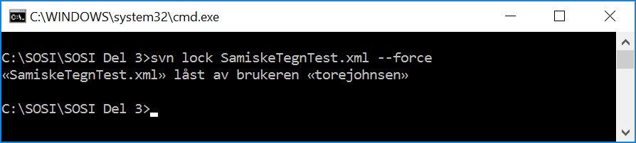

// Ved utsjekk av en pakke kommer det en feilmelding som sier at pakken allerede er sjekket ut

Pakken er låst av enten en annen bruker eller av vedkommende selv. Hvem som har låst pakken kan man se ved å velge «Package Control → File Properties …»

Hvis pakken er sjekket ut til deg, men ikonet på pakken antyder at den ikke er sjekket ut kan du først prøve å høyreklikke på pakken, gå på Package Control og velge Re-synch Status With VC Provider

image::IMG/EA_Synch.png[,, alt="Force lock"]

Hvis løsning over ikke virker må du følge oppskriften under.

NB! Dobbeltsjekk at det er du som har låst pakken før du overstyrer låsen. + 
Hvis pakken er låst av en annen bruker så jobber vedkommende mest sannsynlig med pakkeinnholdet og frigir pakken etter at den er blitt ferdig oppdatert. + 
Er en pakke låst over lengre tid (>= 1 døgn) anbefales det å ta kontakt med administrator eller direkte med den som har låst pakka. + 
Hvis pakken er låst til deg, eller du har fått tillatelse fra den som har låst pakken, så kan låsen fjernes i kommandolinjeklienten. + 
En låst pakke kan overstyres ved å bruke kommando "svn lock 'filnavn' --force" (se eksempel på bildet under).

Hvor fila ligger finner du ut ved å høyreklikke på pakken i EA, så velger du «Package Control → Configure». Feltet «XMI Filename» viser lagringsstedet for filen. + 
Etterpå kjører du kommando «svn unlock 'filnavn'» (se eksempel på bildet under).

image::IMG/EA_unlock1.png[,, alt="Force unlock"]

Pakken kan nå sjekkes ut på vanlig måte i EA.

Alternativt kan dette gjøres ved hjelp av Tortoise klienten i utforskeren. + 
Tortoise-klienten kan lastes ned fra http://tortoisesvn.net/downloads.html + 
Gå til den lokale kopien av SVN-repository-et. Høyreklikk på xml-fila som det gjelder og velg «SVN Get lock», kryss deretter av på ”Steal the locks” for å låse med egen konto (se eksempel på bildene under).

image::IMG/tortoise1.JPG[,, alt="Tortoise"] 

image::IMG/tortoise2.JPG[,, alt="Tortoise"]

Så høyreklikker du på den aktuelle filen igjen og velger «TortoiseSVN → Release lock” for å fjerne låsingen.