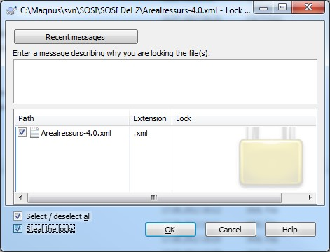

// Ved utsjekk av en pakke kommer det en feilmelding som sier at pakken allerede er sjekket ut

image::IMG/EA_alreadyLocked1.png[,, alt="Allerede sjekket ut"]

Pakka er låst av enten en annen bruker eller av deg selv. 

* Finn ut hvem som har låst pakka og hvilken fil i modellregisteret den er knyttet til
** velg «Package Control → File Properties …» 
*** Feltet "Relative URL" viser hvilken xml-fil pakka er knyttet til

Hvis pakka er sjekket ut til deg, men ikonet på pakka antyder at den ikke er sjekket ut kan du først prøve dette:

* velg Package Control og «Re-synch Status With VC Provider»

.Se skjermbilde for å utføre Re-synch Status With VC Provider
[%collapsible]
======
image::IMG/EA_Synch.png[,, alt="Force lock"]
======

Hvis løsningen over ikke virker, må du fortsette med oppskriften under.

// NB! Dobbeltsjekk at det er du som har låst pakken før du overstyrer låsen.  

* Hvis pakken er låst av en annen bruker:
** avklar om  vedkommende fortsatt jobber med pakka og når den kan frigis etter oppdatering
** ta evt. kontakt med administrator hvis det går lang tid uten avklaring

////
* Hvis pakka er låst av deg, eller du har fått tillatelse fra den som har låst den, kan låsen fjernes.
** Undersøk hvilken fil i modellregisteret pakka tilhører
*** høyreklikk på pakka i EA
*** velg «Package Control → Configure».
*** Feltet «XMI Filename» viser lagringsstedet for filen
** Fjern låsen vha kommandolinjeklienten eller Tortoise-klienten
////

*NB! Dobbeltsjekk at det er du som har låst pakken før du overstyrer låsen.*

.Fjern låsen ved hjelp av kommandolinjeklienten
[%collapsible]
=====
** Start kommandolinjeklienten og gå dit xml-filen befinner seg.
** Overta låsen ved å bruke kommandoen ``svn lock 'filnavn' --force`` (se eksempel under).
** Lås opp ved å bruke kommandoen ``svn unlock 'filnavn'`` (se eksempel under)

.Se skjermbilder for å bruke svn fra kommandolinjeklienten
[%collapsible]
======

////
Hvis løsningen over ikke virker, må du følge oppskriften under.

NB! Dobbeltsjekk at det er du som har låst pakken før du overstyrer låsen. + 
Hvis pakken er låst av en annen bruker så jobber vedkommende mest sannsynlig med pakkeinnholdet og frigir pakken etter at den er blitt ferdig oppdatert. + 
Er en pakke låst over lengre tid (>= 1 døgn), anbefales det å ta kontakt med administrator eller direkte med den som har låst pakka. + 
Hvis pakken er låst til deg, eller du har fått tillatelse fra den som har låst pakken, så kan låsen fjernes i kommandolinjeklienten. + 
En låst pakke kan overstyres ved å bruke kommando "svn lock 'filnavn' --force" (se eksempel på bildet under).

////
image::IMG/EA_lock1.png[,, alt="Force lock i kommandolinjeklienten"]

////
Hvor fila ligger finner du ut ved å høyreklikke på pakken i EA, så velger du «Package Control → Configure». Feltet «XMI Filename» viser lagringsstedet for filen. + 
Etterpå kjører du kommando «svn unlock 'filnavn'» (se eksempel på bildet under).
////

======

=====

eller

.Fjern låsen ved hjelp av Tortoise klienten. 
[%collapsible]
=====
Tortoise-klienten forutsettes installert ihht gjeldende installsjonsveileder. Den kan lastes ned fra http://tortoisesvn.net/downloads.html 

* Lokaliser den aktuelle xml-filen i filbehandleren 

* Overta låsen
** høyreklikk på xml-filen og velg «SVN Get lock» 
** kryss av på ”Steal the locks” for å låse med egen konto (se eksempel på bildene under).

.Se skjermbilder for å overta låsen i Tortoise-klienten
[%collapsible]
======
 

image::IMG/tortoise2.JPG[,, alt="Tortoise"]
======

* Lås opp pakka
** Høyreklikk på xml-filen og velg «TortoiseSVN
** Velg Release lock” for å fjerne låsingen.
=====

* Pakka kan nå sjekkes ut på vanlig måte i EA.