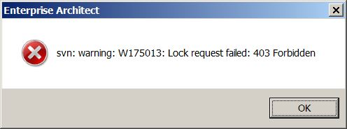

// Bruker får ikke sjekket ut pakker i modellregisteret fordi vedkommende er registrert med feil brukernavn (evt. standardbruker «sosi»)

//Versjon 2024-09-05

Feilmeldingen i EA vil se ut som på bildet under.

//image::IMG/leserettigheter1.JPG[alt="Kun leserettighet"]

* Bytt brukernavn i kommandoklienten som beskrevet nedenfor: 

** åpne kommandolinjeklienten og gå til *C:\SOSI* (den lokale kopien av modellregisteret ) 
** skriv inn kommandoen ``svn update --username 'ditt brukernavn'`` (se eksempel nedenfor). 
** oppgi passord. 

image::IMG/EA_updateUsername1.png[alt="Kommandolinjeklienten. Bytte SVN brukernavn"]

Utover det trengs det ingen endringer i EA eller andre steder. 

* Prøv å sjekke ut en pakke for deretter å sjekke den inn igjen for å se om problemet er løst.

////
For å endre brukernavnet må du åpne kommandolinjeklienten, gå til den lokale kopien av svn-repository (i veilederen er det C:\SOSI) og skriv inn kommando:
«svn update --username 'ditt brukernavn'» (se eksempel nedenfor). + 
Så bør du få spørsmål om passord. Utover det trengs det ingen endringer i EA eller andre steder. + 
////
