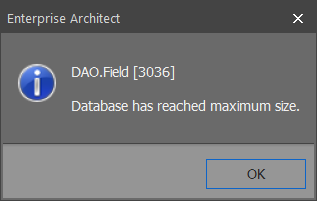
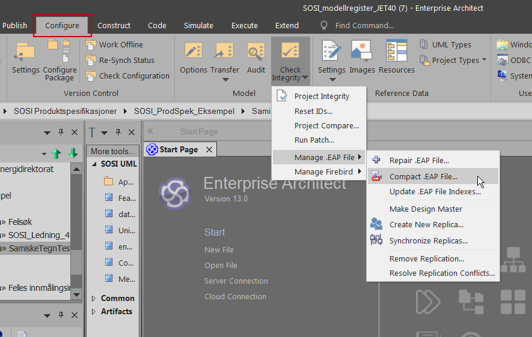

// EA gir en feilmelding om at databasen har oppnådd maksimal størrelse

EA prosjektfiler (.eap) har en begrensning på 1 gigabyte. Vi anbefaler å opprette en helt ny prosjektfil da vi har gjort grep for å få ned størrelsen. Endringen i filstørrelse vil ikke tre i kraft før man har opprettet et nytt prosjekt. Hvordan man oppretter ett nytt prosjekt er beskrevet i http://kartverket.no/globalassets/standard/retningslinjer-og-veiledere/installasjon-av-nodvendig-programvare-for-arbeid-med-sosi-produktspesifikasjoner.pdf[veileder]. + 
EA har en funksjon som heter «Compact», denne kan redusere filstørrelsen betraktelig ved å utelate data som ikke er i bruk. + 
Prosjektfilen skal ikke være åpnet i EA når denne funksjonen kjøres. Gå til “Configure → Check Integrity → Manage .EAP File → Compact .EAP File…” (som vist under). +
Velg prosjektfilen og klikk deretter på “Open”.

