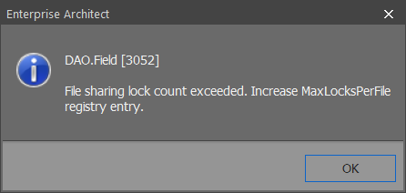

// EA gir en feilmelding hvor det står: "File sharing lock count exceeded. Increase MaxLocksPerFile registry entry"

 
 MaxLocksPerFile

For å løse dette problemet må man endre noen verdier i registeret.

Last ned https://sosi.geonorge.no/SVNFAQ/REG/MaxLocksPerFile_fix.reg[denne filen (.reg)] ved å høyreklikke og velg lagre som. Deretter åpner du den og bekrefter at du ønsker å endre verdiene i registeret. +
Etter dette må du restarte PC'en for at endringene skal tre i kraft.