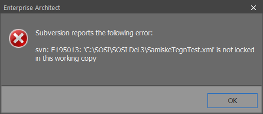
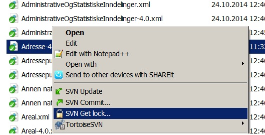

// EA gir en feilmelding om at .xml fil "is not locked in this working copy" når du prøver å sjekke inn en pakke

//For å løse dette problemet anbefaler vi at du har installert TortoiseSVN, som kan lastes ned fra http://tortoisesvn.net/downloads.html. + 
* Gå til den lokale mappen som inneholder kopien av modellregisteret. 
* Høyreklikk på den aktuelle .xml-filen og velg "SVN Get Lock..." (som vist på bildet under). +
* Huk av på "Steal the locks" og trykk OK. 
* Nå kan du prøve å sjekke inn pakken i EA.

Hvis du er usikker på hvor du finner filen, høyreklikk på den aktuelle pakken i EA og velg "Package Control → Configure..." +
Der kan man se hvor filen ligger i den lokale mappen.

