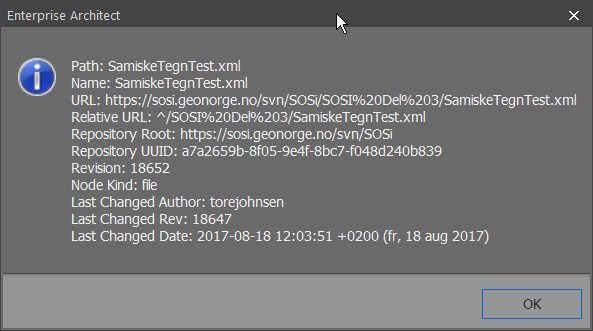
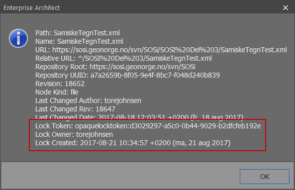

// Endringer som andre har utført i en pakke vises ikke hos meg. En oppdatering (Get Latest/Get All Latest) hjelper heller ikke

Dette forekommer når den som har gjort endringer i en pakke har glemt å sjekke inn den aktuelle pakka, eller en overordnet pakke. 

* Undersøk hvem som har sjekket ut (låst) den aktuelle pakka
** høyreklikk på pakka 
** velg «Package Control → File Properties». 
** sammenlign med eksemplene under

////
Hvem som har sjekket ut en pakke kan man se ved å høyreklikke på den aktuelle pakken og velge «Package Control → File Properties». +
Bildene under viser en pakke som ikke er låst og en som er låst. Hvis du ser informasjonen som er i rød ramme så er pakken låst og må sjekkes inn av den som har låst den før du kan se endringer som er gjort i pakken.
////

.Se eksempel på en pakke som ikke er låst:
[%collapsible]
======

======

.Se eksempel på en pakke som er låst:
[%collapsible]
======

Pakka er låst av bruker "torejohnsen":
======

* Nå må pakka sjekkes inn av den som har låst den
* Utfør «Get latest» på pakka for å se endringene
