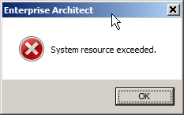

// EA gir en feilmelding hvor det står: "System resources exceeded"

 
MaxLocksPerFile
Endra til alt="System resources exceeded"

Dette løses i mange tilfeller med å endre noen verdier i registeret (samme som med "File sharing lock count exceeded")

Last ned https://sosi.geonorge.no/SVNFAQ/REG/MaxLocksPerFile_fix.reg[denne filen (.reg)] ved å høyreklikke og velg lagre som. Deretter åpner du den og bekrefter at du ønsker å endre verdiene i registeret. + 
Etter dette må du restarte PC'en for at endringene skal tre i kraft.