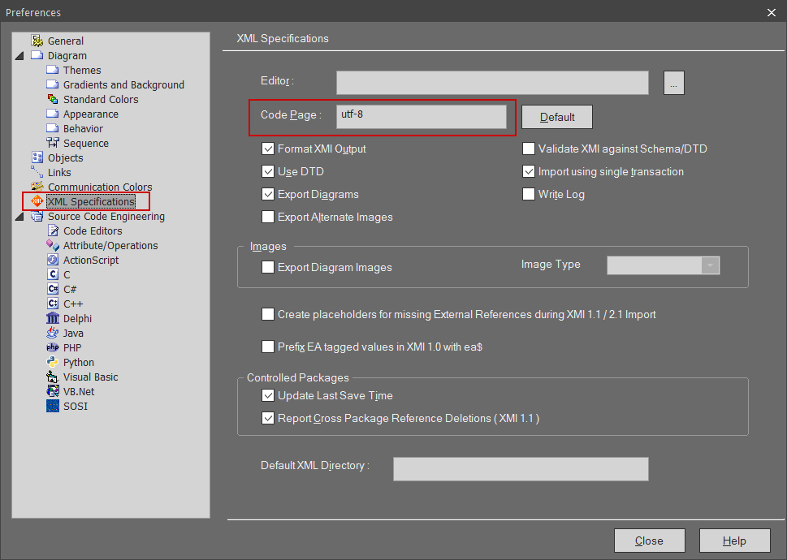

// Samiske tegn vises ikke korrekt ved bruk av Enterprise Architect

// Versjon 2024-09-05

Enterprise Architect bruker i utgangspunktet windows-1252 tegnsett ved lagring av XMI-fil til SOSI-modellregister. 
Dette tegnsettet har ikke støtte for alle samiske tegn. 

For at Enterprise Architect skal bruke UTF-8 tegnsett må man gjøre noen grep:

// henvis til installasjonsveilederen ?

* Gå til "Start → Preferences"
* Velg "XML Specifications" i menyen. 
** Skriv inn 'utf-8' i feltet for "Code Page"

.Skjermbilde for å endre tegnsett til URTF-8
[%collapsible]
======

======

Samiske tegn skal nå vises korrekt. Hvis ikke, er det mulig du må legge dem inn på nytt, eller hente en eldre versjon av pakka fra før tegnsettfeilen oppsto.
