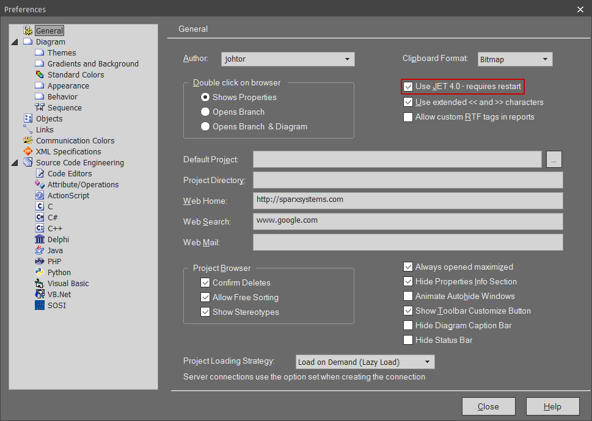

// Samiske tegn vises ikke korrekt ved bruk av Enterprise Architect
Versjon 2024-08-30

Enterprise Architect bruker windows-1252 tegnsett som ikke har full støtte for alle Samiske tegn. + 
For at Enterprise Architect skal bruke UTF-8 tegnsett må man gjøre noen grep.

== EA15 eller eldre
Hvis du har EA15 eller eldre; gå til "Start → Preferences". Huk av på "Use JET 4.0" som vist på bildet under.

Deretter klikker du på valget "XML Specifications" i menyen. Skriv inn 'utf-8' i feltet for "Code Page", som vist på bildet under.

image::IMG/EA_preferencesUTF81.png[,, alt="UTF-8"]

Start deretter EA på nytt for at de nye instillingene skal tre i kraft.

Last deretter ned http://sosi.geonorge.no/SVNFAQ/EAP/SOSI_modellregister_JET40.eap[denne .EAP filen]. (høyreklikk og velg "Lagre linken som... / Save target as...")
Dette er en .EAP fil med hele SOSI-modellregisteret (oppdatert 08.10.2020).

Åpne denne .EAP filen i Enterprise Architect og kjør "Get all latest". Du kan nå bruke denne .EAP filen for videre arbeid mot modellregisteret.

Samiske tegn vil nå vises korrekt. Samiske tegn som allerede er lagret ukorrekt må legges inn på nytt med denne .EAP filen.

== EA16 og nyere

Da må du bare gå til "Start → Preferences". og klikke på valget "XML Specifications" i menyen. Skriv inn 'utf-8' i feltet for "Code Page", som vist på bildet under.

image::IMG/EA_preferencesUTF81.png[,, alt="UTF-8"]

== Samiske tegn skal nå vises korrekt. Hvis ikke er det mulig du må hente en eldre versjon av pakka fra før tegnsettfeilen oppsto.
