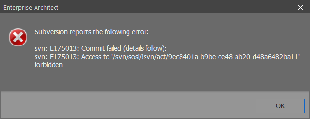
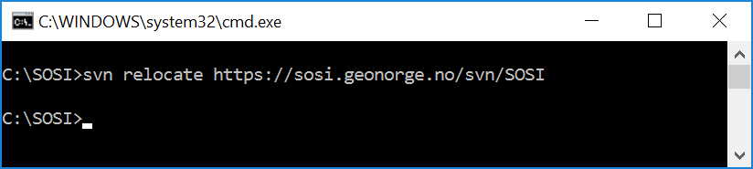

// Kan sjekke ut modeller, men ikke sjekke inn lokal versjon tilbake til serveren

Feilmeldingen i EA vil se ut som på bildet under.

Løsning: Sannsynligvis finnes det en liten feil i URL-en. Den er case sensitive og bør se sånn ut: 
https://sosi.geonorge.no/svn/SOSI + 
I dette tilfellet må URL’en som den lokale kopien av repository-et peker til tilpasses.
I kommandolinjeklienten går man til mappen som inneholder den lokale kopien.
Der kan URL’en endres med ”svn relocate https://sosi.geonorge.no/svn/SOSI”, som vist på bildet under.

