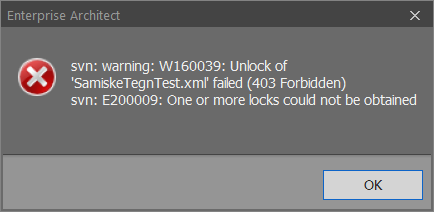

// Kan ikke sjekke ut en pakke og feilmeldingen sier "403 Forbidden"

//Versjon 2024-09-05

Feilmeldingen i EA vil se ut som på bildet under.

//image::./IMG/leserettigheter1.PNG[alt="Kun leserettighet"]

Du har da antakelig bare leserettigheter til pakka. + 
For å få tilgang tar du kontakt med Standardiseringssekretariatet (standardiseringssekretariatet@kartverket.no) og angir hvilken pakke det gjelder. Oppgi også hvilket fagområde er du editor for eller hvilken produktspesifikasjon du vil jobbe med.

